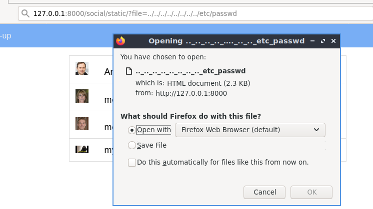

# What is the HeadPage?

A Simple and porpousely vulnerable django web-application for testing and learning how to protect using the Trend Micro Application Security.

# What is the Cloud One Application Security?

Trend Micro Cloud One - Application Security provides runtime protection for containerized applications and serverless functions. When Application Security is properly deployed, threats to your web applications will be detected and protected against, minimizing your risk. Determined attackers are continuously running scanners against your site, creating malicious user accounts, fuzzing various elements, triggering exceptions, and attempting to run exploitation tools.

* More information here: https://cloudone.trendmicro.com/docs/application-security/
* Create a account in Cloud One https://cloudone.trendmicro.com/

## Running 
The recommended way is using docker using the following commands to build and run the container.

`yum install git -y`

`git clone https://github.com/caf3ina/HeadPage.git`

`cd HeadPage/`

* Edit the following line on `src/headpage/settings.py` to serve HeadPage on all interfaces. This can be dangerous, if possible run inside a VM on Host-Only interface.

`ALLOWED_HOSTS = ['*']`

`create a file with name trend_app_protect.ini` and put the information bellow.

`[trend_app_protect]`
`key = my-key`
`secret = my-secret`

Take de key and secret from Cloud One Application Security
https://cloudone.trendmicro.com/docs/application-security/python/#install-the-agent

`docker build --tag=headpage:latest .`

`docker run -d --rm -p 8000:8000 --name headpage headpage:latest`

## The site is ugly as sin!
**Yes** - Also, I'm not a web developer
* Open the url http://ip-address:8000/social/

## Main Vulnerabilities

### SQL Injection
* Login and Register user forms use raw, unsanitized SQL queries and are subject to injection via trailing comment and `'` to close strings

### XSS
* The user's first/last name or username are not sanitized and are displayed on their profile.
    * E.g. username: ``

### Open Redirect
* When clicking the link to the login/register page from a previous page, the previous Page URL is sent as a Parameter for a redirection back to the previous page after loging in/registering. The redirection URL is not validated.
    * E.g. 127.0.0.1:8000/social/login/?redirect=evilsite.url

### Remote Code Execution
* The user can choose a picture already uploaded for his profile, or download an image from a URL. The download is done by invoking `wget` without escaping the user input
    * E.g. On the picture URL field `; touch evil.sh #`
* (based on the django.nV injection vuln) The user can upload a file and give an arbitrary name (or rename already uploaded files). The rename is done with `mv`. This process is vulnerable to code injection in the new file name, or replacing an existing program with a malicious version

### Malicious File Upload
* There is no file checking on user uploaded files, or URL downloads.

### Illegal File Access / Path Traversal
* Some static files are returned after GET requests `127.0.0.1:8000/social/static/?file=privacy.txt` The `file` in the GET is not properly validated/sanitized

### Console Events

* Malicious Payload

